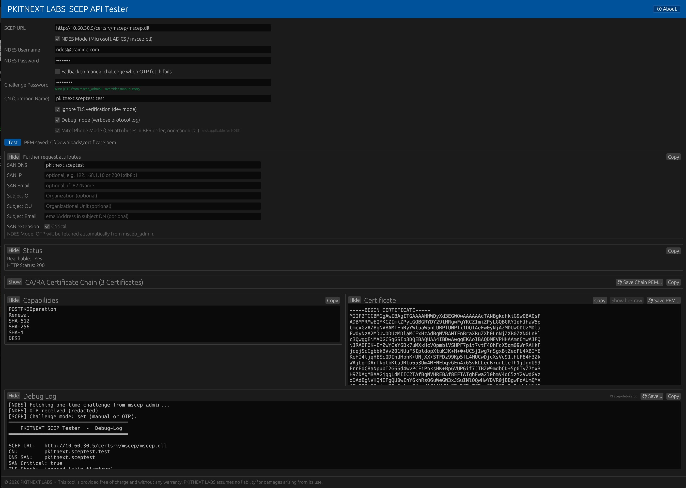

# Free SCEP & Microsoft NDES Diagnostic Tools by PKITNEXT LABS

Free diagnostic and testing utilities by **PKITNEXT LABS** for **SCEP tester** workflows, **Microsoft NDES tester** scenarios, **AD CS certificate enrollment**, **Mitel SCEP**, **VoIP certificate automation**, **SIP/TLS certificates**, and **enterprise PKI** troubleshooting.

These tools help administrators and security teams validate SCEP/NDES enrollment behavior, troubleshoot certificate provisioning failures, and verify processes around **X.509 certificate renewal**, **PKI automation**, and **certificate lifecycle management** across Windows, Linux, VoIP, Mitel, and hybrid enterprise environments.

> This repository provides free diagnostic utilities by PKITNEXT LABS. It is not positioned as a full enterprise certificate management platform.

## What You Get Here (Quick Answer)

This repository is primarily used as a public entry point for:

- **SCEP API Tester** (Windows/macOS) for SCEP and Microsoft NDES diagnostics
- **Windows Certificate Agent** for automated enrollment and renewal on Windows
- A clear bridge to **PKITNEXT SOLUTION** for enterprise certificate lifecycle automation

If you are evaluating PKITNEXT, start with:

1. [Release Downloads](#release-downloads)
2. [Screenshots](#screenshots)
3. [From Diagnostic Tool to Enterprise Automation](#from-diagnostic-tool-to-enterprise-automation)

## Repository Scope Note

This repository currently also contains additional Linux-oriented components (Linux SCEP Agent, Tomcat workflows, UC certificate installer, packaging assets).
They are included for operational completeness, but they are not the primary entry point for first-time visitors evaluating the public SCEP diagnostic tooling.

## From Diagnostic Tool to Enterprise Automation

The free tools in this repository are designed for **testing, troubleshooting, and technical validation**.

When individual diagnostics need to become a centralized, auditable, enterprise process, **PKITNEXT SOLUTION** is the next step: an on-premises platform for automated **X.509 certificate lifecycle management** for VoIP, IoT, Windows, Linux, and internal services.

PKITNEXT SOLUTION supports, among others:

- Automated enrollment and renewal
- Reduced manual certificate ticket workload
- Auditability and traceable operations
- On-premises operation in regulated environments
- Enterprise-scale rollout across many systems and sites
- Support for telecom/VoIP and industrial environments

## Need Help With SCEP, NDES or Certificate Renewal?

If your SCEP or NDES test fails, or if certificate renewal is still handled manually, PKITNEXT can help you move from troubleshooting to automated certificate lifecycle management.

- Send us your redacted debug log for an initial assessment: [Contact PKITNEXT](https://www.pkitnext.de/anfrage/)
- Book a PKITNEXT SCEP/NDES Health Check: [Submit request](https://www.pkitnext.de/anfrage/)
- Request an enterprise automation demo: [Visit PKITNEXT](https://www.pkitnext.de/)

## Who Should Use This?

- Microsoft AD CS / NDES administrators
- VoIP and telecom teams using SIP/TLS certificates
- Mitel phone and PBX environments
- PKI and security teams
- Industrial, IoT, and internal service environments
- MSPs and system integrators

## Typical Use Cases

- Test Microsoft NDES / SCEP endpoints
- Validate GetCACaps, GetCACert, PKCSReq, and CertRep flows
- Troubleshoot failed certificate enrollment
- Test Mitel-specific SCEP behavior
- Validate SAN and certificate profile settings
- Prepare enterprise rollout of automated certificate renewal
- Collect redacted debug logs for support or pre-sales analysis

## Free Tools vs. PKITNEXT SOLUTION

**Free diagnostic tools (this repository):**

- Local testing
- Diagnostics and protocol analysis
- Single-system validation
- Manual troubleshooting

**PKITNEXT SOLUTION (enterprise platform):**

- Centralized certificate lifecycle management
- Enterprise rollout and governance
- End-to-end automation
- Policy-based enrollment
- Audit and reporting
- Professional support and rollout guidance

## Trust & Security Notes

- No telemetry is collected by the diagnostic workflow.
- The diagnostic tools are designed to run locally and do not require cloud connectivity for normal diagnostic workflows.
- Private keys are generated locally and are not intentionally transmitted by the tools.
- Offline-capable operation is possible where applicable
- Review debug logs before sharing
- Redact sensitive values such as OTP/challenge passwords before sharing

## What's In This Repository?

| Tool | Purpose | Platforms |
| --- | --- | --- |
| **SCEP API Tester** | GUI diagnostic workflow for end-to-end SCEP server tests | Windows, macOS |
| **Windows Certificate Agent** | Automated enrollment and renewal as a Windows service | Windows |
| **Linux SCEP Agent (when included)** | Automated enrollment, lifecycle checks, and renewal workflows for Linux services | Linux |
| **Tomcat Agent (when included)** | PKCS#12-oriented enrollment and renewal flow for Tomcat | Linux |

Additional PKITNEXT agent components may be documented here when they are included in this repository or released as companion tools.

The tooling is aligned around RFC 8894 SCEP interoperability and enterprise PKI troubleshooting.

## Why PKITNEXT?

| Operational Problem | Typical Legacy Approach | PKITNEXT LABS Diagnostic Approach |
| --- | --- | --- |
| SCEP server debugging | Raw traces, packet capture, trial and error | Structured, step-based diagnostics with protocol visibility |
| Enrollment failures | Manual reproduction with inconsistent inputs | Repeatable test runs with explicit request parameters |
| NDES complexity | Manual OTP handling and opaque errors | NDES-aware diagnostics and log-first troubleshooting |
| Mitel interoperability | Generic tooling often mismatches CSR behavior | Mitel-focused test paths and validation options |
| Audit readiness | Low traceability of troubleshooting actions | Exportable debug output and reproducible test evidence |

## Cross-Platform Architecture (ASCII)

```text
┌───────────────────────────────────────────────────────────┐
│                      Windows / macOS / Linux              │
│                                                           │
│   ┌─────────────────────┐   ┌─────────────────────────┐   │
│   │   SCEP API Tester   │   │  Certificate Agents     │   │
│   │   (GUI)             │   │ (Windows / Linux)       │   │
│   └──────────┬──────────┘   └───────────┬─────────────┘   │
│              └──────────┬───────────────┘                 │
│              ┌──────────▼──────────┐                      │
│              │      scep-core      │                      │
│              │  Protocol handling  │                      │
│              │  RFC 8894 / CMS     │                      │
│              └──────────┬──────────┘                      │
└─────────────────────────┼─────────────────────────────────┘
                          │  HTTPS  (RFC 8894)
          ┌───────────────▼──────────────────┐
          │     SCEP Certificate Authority   │
          │  PKITNEXT  │  MS NDES  │  EJBCA  │
          │  OpenXPKI  │  other RFC 8894 CAs │
          └──────────────────────────────────┘
```

## SCEP Protocol Flow (ASCII)

```text
Client                              CA
  │                                  │
  │──── GET  GetCACaps ─────────────►│  Capabilities (SHA-256, AES, ...)
  │                                  │
  │──── GET  GetCACert ─────────────►│  CA certificate chain (DER / PKCS#7)
  │                                  │
  │  [generate RSA key pair + CSR]   │
  │                                  │
  │──── POST PKIOperation ──────────►│  PKCSReq (CMS EnvelopedData -> SignedData -> CSR)
  │                                  │
  │◄─── CertRep ─────────────────────│  pkiStatus: SUCCESS / PENDING / FAILURE
  │                                  │
  │  [decrypt -> extract certificate]│
```

## Screenshots




The NDES view demonstrates automated challenge retrieval for Microsoft AD CS / NDES diagnostics.

## Release Downloads

[](https://github.com/PKITNEXT/pkitnext-scep-api-tester/releases/latest)
[](https://github.com/PKITNEXT/pkitnext-scep-api-tester/releases/latest)

Download all current binaries from:

- [PKITNEXT SCEP Tools - Latest Release](https://github.com/PKITNEXT/pkitnext-scep-api-tester/releases/latest)
- [Windows SCEP Agent - Latest Release](https://github.com/PKITNEXT/pkitnext-scep-api-tester/releases/latest)
- [Linux SCEP Agent RPM - Latest Release](https://github.com/PKITNEXT/Linux-SCEP-Agent/releases/latest)

### SCEP API Tester Downloads

| Platform | Artifact |
| --- | --- |
| Windows x64 | `scep-tester.exe` |
| macOS Apple Silicon (arm64) | `scep-tester-macos-arm64.zip` |
| macOS Intel (x86_64) | `scep-tester-macos-intel.zip` |

### Windows Certificate Agent Downloads

Direct release page:

- [Windows SCEP Agent Releases](https://github.com/PKITNEXT/pkitnext-scep-api-tester/releases/latest)

| Artifact | Description |
| --- | --- |
| `windows-scep-client-*.msi` | MSI installer (recommended) |
| `windows-scep-client-*-x64.zip` | Portable ZIP package |

## Additional Linux Components (In This Repository)

The sections below summarize Linux and server-side workflows for teams that need more than the Windows/macOS diagnostic entry point.

## PKITNEXT Linux Agent (Summary)

- Automated RFC 8894 SCEP enrollment and renewal workflows for Linux services
- Includes Apache-oriented lifecycle orchestration and systemd timer operation
- Configuration templates: [examples/pkitnext-agent.yaml](examples/pkitnext-agent.yaml)
- systemd units: [deploy/systemd/pkitnext-agent.service](deploy/systemd/pkitnext-agent.service), [deploy/systemd/pkitnext-agent.timer](deploy/systemd/pkitnext-agent.timer)

## Tomcat Agent (Summary)

- PKCS#12-oriented enrollment and renewal flow for Tomcat environments
- Template: [examples/pkitnext-tomcat-agent.yaml](examples/pkitnext-tomcat-agent.yaml)
- systemd units: [deploy/systemd/pkitnext-tomcat-agent.service](deploy/systemd/pkitnext-tomcat-agent.service), [deploy/systemd/pkitnext-tomcat-agent.timer](deploy/systemd/pkitnext-tomcat-agent.timer)

## UC Certificate Installer (Summary)

- Includes UC automation utility for Mitel / Unify OpenScape UC workflows
- Usage documentation: [scripts/README.md](scripts/README.md)

## RPM Packaging (Summary)

- RPM packaging and build workflow are included for enterprise Linux rollout scenarios
- Build references: [INSTALL.md](INSTALL.md)
- Linux RPM release page: [PKITNEXT Linux SCEP Agent Releases](https://github.com/PKITNEXT/Linux-SCEP-Agent/releases/latest)

## Extended Documentation

- Planned deep-dive docs:
  - `docs/linux-agent.md` (TODO)
  - `docs/tomcat-agent.md` (TODO)
  - `docs/uc-certificate-installer.md` (TODO)
  - `docs/rpm-packaging.md` (TODO)

## License / Usage Notice

- These tools are provided as free diagnostic utilities by PKITNEXT LABS.
- This repository is not positioned as an open-source project unless a separate open-source license is added.
- Enterprise support, rollout planning and automated certificate lifecycle management are available through PKITNEXT.

## Support & Commercial Note

These tools are provided by **PKITNEXT LABS** as free diagnostic utilities.
For enterprise support, rollout planning, or automated certificate lifecycle management, contact **PKITNEXT**:

- Contact form: [https://www.pkitnext.de/anfrage/](https://www.pkitnext.de/anfrage/)
- Website: [https://www.pkitnext.de/](https://www.pkitnext.de/)
