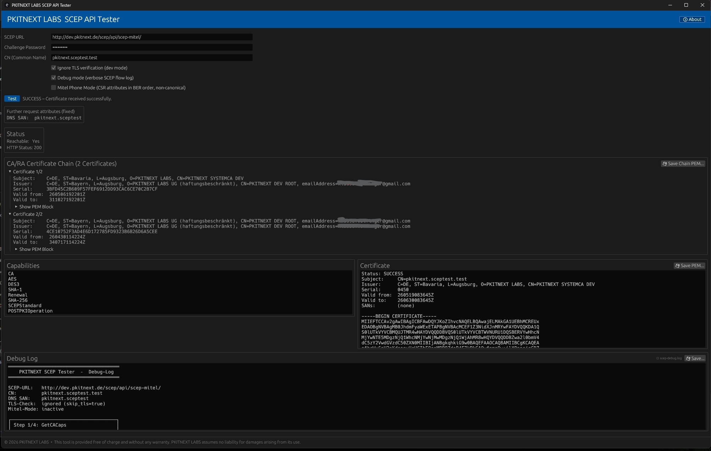

# PKITNEXT LABS – SCEP Tools for Windows & macOS

> Free tools for SCEP certificate enrollment and automated certificate lifecycle management

[](https://github.com/PKITNEXT/pkitnext-scep-api-tester/releases/latest)
[](https://github.com/PKITNEXT/pkitnext-scep-api-tester/releases/latest)
[](https://www.rust-lang.org/)

---

## What's in this repo?

| Tool | Purpose | Platforms |
|---|---|---|
| [**SCEP API Tester**](#scep-api-tester) | GUI diagnostic tool — test a SCEP server in one click | Windows, macOS |
| [**Windows Certificate Agent**](#windows-certificate-agent) | Automated enrollment & renewal as a Windows service | Windows |

Both tools are built in a library that implements RFC 8894.

---

## Why PKITNEXT?

| Problem | Existing Tools | PKITNEXT |
|---|---|---|
| **SCEP server debugging** | Difficult — raw logs, Wireshark, trial and error | One click — full trace with step-by-step SCEP debug log |
| **Certificate renewal** | Manual — someone has to remember and act | Automated — Windows service renews before expiry, zero downtime |
| **Mitel phone support** | Broken — standard tools send wrong CSR attribute order | Built-in Mitel Phone Mode with correct BER-ordered attributes |
| **Cross-platform testing** | Limited — most tools Windows-only | Windows x64 + macOS (Apple Silicon and Intel) |
| **Deployment** | Complex — dependencies, runtimes, installers | Portable single executable — download and run |
| **Private key safety** | Often unclear | Private key generated locally, never transmitted, never logged |
| **Audit trail** | None | Verbose debug log exportable to file |

---

## Architecture

```
┌─────────────────────────────────────────────────────────────┐
│                      Windows / macOS                        │
│                                                             │
│   ┌─────────────────────┐   ┌─────────────────────────┐     │
│   │   SCEP API Tester   │   │  Windows Cert Agent     │     │
│   │   (GUI · eframe)    │   │  (CLI + Windows Service)│     │
│   └──────────┬──────────┘   └───────────┬─────────────┘     │
│              │                          │                   │
│              └──────────┬───────────────┘                   │
│                         │                                   │
│              ┌──────────▼──────────┐                        │
│              │      scep-core      │                        │
│              │  (Rust library)     │                        │
│              │  RFC 8894 / CMS     │                        │
│              └──────────┬──────────┘                        │
└─────────────────────────┼───────────────────────────────────┘
                          │  HTTPS  (RFC 8894)
          ┌───────────────▼──────────────────┐
          │     SCEP Certificate Authority    │
          │                                  │
          │  PKITNEXT  │  MS NDES  │  EJBCA  │
          │  OpenXPKI  │  any RFC 8894 CA    │
          └──────────────────────────────────┘
```

### SCEP Protocol Flow

```
Client                              CA
  │                                  │
  │──── GET  GetCACaps ─────────────►│  Capabilities (SHA-256, AES, POSTPKIOperation …)
  │                                  │
  │──── GET  GetCACert ─────────────►│  CA certificate chain (DER / PKCS#7)
  │                                  │
  │  [generate RSA key pair + CSR]   │
  │                                  │
  │──── POST PKIOperation ──────────►│  PKCSReq  (CMS EnvelopedData → SignedData → CSR)
  │                                  │
  │◄─── CertRep ────────────────────│  pkiStatus: SUCCESS / PENDING / FAILURE
  │                                  │
  │  [decrypt → extract certificate] │
```

---

## SCEP API Tester

A graphical desktop tool to run a full SCEP enrollment test against any SCEP server endpoint.  
No installation required. Download, double-click, test.

### Download

Go to [**Releases**](https://github.com/PKITNEXT/pkitnext-scep-api-tester/releases/latest) and download:

| Platform | File |
|---|---|
| Windows x64 | `scep-tester.exe` |
| macOS Apple Silicon | `scep-tester-macos-arm64.zip` |
| macOS Intel | `scep-tester-macos-intel.zip` |

### Install in under 5 minutes

**Windows:**
1. Download `scep-tester.exe`
2. Double-click — no installer, no runtime required
3. Enter your SCEP URL and click **Test**

**macOS:**
1. Download and unzip the archive for your chip (Apple Silicon or Intel)
2. Remove the quarantine flag and make executable:
   ```bash
   xattr -d com.apple.quarantine scep-tester
   chmod +x scep-tester
   ./scep-tester
   ```
3. Enter your SCEP URL and click **Test**

### Screenshot



### What the tester checks

Runs the full SCEP enrollment cycle and shows the result live in the UI:

| Step | Operation | What you see |
|---|---|---|
| 1 | `GetCACaps` | Server capabilities (algorithms, POST support, …) |
| 2 | `GetCACert` | CA certificate chain with subject and validity |
| 3 | `PKCSReq` | RSA key pair + CSR generated on the fly, sent to CA |
| 4 | `CertRep` | Issued certificate: subject, SANs, validity, fingerprint |

**Features:**
- Challenge password support
- TLS verification bypass (dev / lab mode)
- Verbose step-by-step debug log — save to file for support tickets
- **Mitel Phone Mode** — BER-ordered CSR attributes for Mitel SIP phones
- Save the full CA certificate chain as PEM
- About dialog with EULA

---

## Windows Certificate Agent

A command-line tool and Windows service for automated certificate enrollment and renewal via SCEP.  
Set it up once, and it keeps your certificate valid forever.

### Download

Go to [**Releases**](https://github.com/PKITNEXT/pkitnext-scep-api-tester/releases/latest) and download:

| File | Description |
|---|---|
| `windows-scep-client-*.msi` | MSI installer (recommended) — installs to `C:\Program Files\PKITNEXT\SCEP Agent\` |
| `windows-scep-client-*-x64.zip` | Portable ZIP — EXE + example config |

**Requirements:** Windows 10 / Server 2016 or newer (x64) · Administrator rights for service installation

### Install in under 5 minutes

```powershell
# 1. Generate a ready-to-use config file
windows-scep-client.exe --create-conf

# 2. Edit the config (Notepad or any editor)
notepad windows-scep-client.yaml

# 3. Test a one-time enrollment
windows-scep-client.exe --config windows-scep-client.yaml enroll

# 4. Install as auto-start Windows service (run PowerShell as Administrator)
windows-scep-client.exe --config C:\ProgramData\pkitnext\client.yaml install-service
windows-scep-client.exe start-service
```

Done. The agent checks the certificate every 24 hours and renews automatically 30 days before expiry.

### Configuration file

Generated by `--create-conf`. All options explained:

```yaml
# SCEP server URL
scep_url: "https://ca.example.com/scep/api/your-profile/"

# Certificate subject
common_name: "myhost.example.com"

# Subject Alternative Names (optional)
san_dns: "myhost.example.com"
# san_ip: "192.168.1.1"

# Output paths (PEM format)
cert_output: "C:/ProgramData/pkitnext/cert.pem"
key_output:  "C:/ProgramData/pkitnext/key.pem"

# SCEP challenge password
challenge_password: "your-challenge-secret"

# Renewal threshold: renew this many days before expiry (default: 30)
days_before_expiry: 30

# Service check interval in hours (default: 24)
check_interval_hours: 24

# Windows Certificate Store — also import into certstore (optional)
# cert_store: "LocalMachine\\MY"

# Log file for service mode (optional)
# log_file: "C:/ProgramData/pkitnext/windows-scep-client.log"
```

### All commands

```powershell
# Enrollment & renewal
windows-scep-client.exe --config client.yaml enroll               # Request a new certificate
windows-scep-client.exe --config client.yaml renew                # Renew if near expiry
windows-scep-client.exe --config client.yaml renew --force-renew  # Renew immediately

# Certificate status
windows-scep-client.exe --config client.yaml status               # Subject, expiry, path

# Windows Certificate Store test
windows-scep-client.exe --config client.yaml test-certstore       # Import → verify → remove

# Windows Service (requires Administrator)
windows-scep-client.exe --config client.yaml install-service
windows-scep-client.exe start-service
windows-scep-client.exe stop-service
windows-scep-client.exe uninstall-service

# Config helper
windows-scep-client.exe --create-conf   # Write default config to disk
windows-scep-client.exe --help          # Full help text
```

### How the service works

```
Service starts
      │
      ▼
Load config.yaml
      │
      ▼
┌──────────────────────────┐
│  Certificate exists?     │
│  Valid? > threshold?     │──── Yes ──► sleep check_interval_hours ──┐
└──────────┬───────────────┘                                          │
           │ No / expiry within threshold                             │
           ▼                                                          │
    SCEP Enrollment                                                   │
    PKCSReq → CertRep                                                 │
           │                                                          │
           ▼                                                          │
    Write cert.pem + key.pem                                          │
    (+ import to Windows Cert Store if cert_store is configured)      │
           │                                                          │
           └──────────────────────────────────────────────────────────┘
```

---

## Security Design

Security software requires trust. Here is what these tools do — and what they deliberately do not do:

| Property | Detail |
|---|---|
| **No telemetry** | No data is sent anywhere except to your configured SCEP server |
| **No cloud dependency** | Fully offline-capable — no license server, no update check, no analytics |
| **Local key generation** | RSA key pairs are generated on the machine, never transmitted |
| **Private key never leaves the machine** | Only the CSR (public key + subject) is sent to the CA |
| **TLS validation** | TLS certificate verification is enabled by default; bypass is opt-in (lab/dev only) |
| **RFC 8894 compliant** | Standard SCEP protocol — no proprietary extensions required |
| **Memory-safe implementation** | Written in Rust — no buffer overflows, no use-after-free, no null pointer dereferences |

---

## CA Compatibility

| CA | Notes |
|---|---|
| **PKITNEXT** | Full support including scep_v2 server |
| **Microsoft NDES** | Standard RFC 8894 enrollment |
| **EJBCA** | Standard RFC 8894 enrollment |
| **OpenXPKI** | Standard RFC 8894 enrollment |
| **Mitel PBX** | Use Mitel Phone Mode in the SCEP API Tester |

---

## Roadmap

### ✅ Phase 1 — Windows & macOS Tools (released)

| Tool | Description |
|---|---|
| SCEP API Tester | GUI diagnostic tool for Windows and macOS |
| Windows Certificate Agent | CLI + Windows Service — MSI installer + portable ZIP |

---

### 🔄 Phase 2 — Linux Certificate Agent (next release)

Automated certificate lifecycle management for Linux servers — packaged as RPM, deployed via systemd.

**Apache Agent** (`pkitnext-agent`)

- Scans Apache config directories (`/etc/apache2`, `/etc/httpd`) for SSL virtual hosts
- Reads `SSLCertificateFile`, `SSLCertificateKeyFile`, `SSLCertificateChainFile` directives
- Enrolls via SCEP, writes PEM files, runs `apachectl configtest`, then `systemctl reload`
- Rolls back to backup on any error — service stays up
- Optional AES-256-encrypted private key with auto-managed passphrase file
- systemd service + timer for fully unattended renewal

**Tomcat Agent** (`pkitnext-tomcat-agent`)

- Scans `server.xml` for SSL keystore references
- Builds a PKCS#12 keystore from issued certificate + private key + CA chain
- Writes keystore atomically, then `systemctl restart tomcat`
- Same backup/rollback safety as Apache agent
- systemd service + timer included

**UC Certificate Installer** — specialized for Mitel (former Unify) OpenScape UC Application V10/V11

- Fully automated 10-phase installation with rollback support
- Handles all UC-specific certificate integration steps

**Config (YAML):**
```yaml
scep:
  url: https://ca.example.com/scep/api/your-profile/
  challenge_password: secret

subject:
  common_name: web01.example.com
  san: [web01.example.com]

certificate:
  cert_path: /etc/pkitnext/certs/server.crt
  key_path:  /etc/pkitnext/certs/server.key
  backup_directory: /etc/pkitnext/backup

renewal:
  renew_before_days: 30
```

---

### 📋 Phase 3 — Broader Linux Support

| Feature | Description |
|---|---|
| DEB / APT packaging | Ubuntu and Debian support alongside RPM |
| Nginx Agent | SSL cert management for Nginx virtual hosts |
| HAProxy Agent | Certificate updates for HAProxy `bind` directives |

---

### 📋 Phase 4 — Enterprise & Cloud

| Feature | Description |
|---|---|
| macOS Certificate Agent | LaunchDaemon-based service for macOS servers |
| Multi-CA failover | Multiple SCEP endpoints with automatic failover |
| Ansible role | Deploy and configure the Linux agent via Ansible |
| EST protocol (RFC 7030) | Modern alternative to SCEP for EST-capable CAs |

---

## About PKITNEXT LABS

PKITNEXT LABS develops PKI and certificate lifecycle management solutions.

🌐 [pkitnext.de](https://www.pkitnext.de)

---

© 2026 PKITNEXT LABS · All rights reserved
